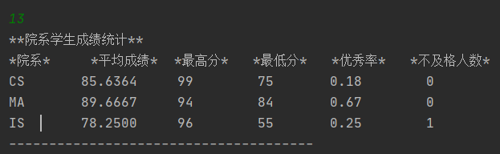

# 学生数据库JAVA应用

> 版本说明
>
> * `java`:`jdk1.8.0_261`
> * `mysql驱动`:`mysql-connector-java-8.0.22.jar`
> * `mysql数据库`:`Ver 8.0.22 for Linux on x86_64 (MySQL Community Server - GPL)`

## Get Start

> 快速使用

在`MysqlClass.java`中（line 18，[点击这里](https://github.com/AgentGuo/StudentSqlwithJdbc/blob/main/src/jdbc/MysqlClass.java)），将如下的配置信息修改为你的数据库的信息

~~~java
    public MysqlClass(){
        //驱动程序名
        String driver = "com.mysql.jdbc.Driver";
        //URL指向要访问的数据库名mydata
        String url = "jdbc:mysql://localhost:3306/CSEDB_U201811010";
        //MySQL配置时的用户名
        String user = "root";
        //MySQL配置时的密码
        String password = "qwer";
~~~

**then run it !!!**

## 数据库说明

数据库有三个表，Student、Course、SC，各个表的字段信息如下：

**Student**（char长度适当即可）

~~~
+-------------+----------------+-----------+
| COLUMN_NAME | COLUMN_COMMENT | DATA_TYPE |
+-------------+----------------+-----------+
| Sage        |                | smallint  |
| Scholarship |                | char      |
| Sdept       |                | char      |
| Sname       |                | char      |
| Sno         |                | char      |
| Ssex        |                | char      |
+-------------+----------------+-----------+
~~~

**Course**（char长度适当即可）

~~~
+-------------+----------------+-----------+
| COLUMN_NAME | COLUMN_COMMENT | DATA_TYPE |
+-------------+----------------+-----------+
| Ccredit     |                | smallint  |
| Cname       |                | char      |
| Cno         |                | char      |
| Cpno        |                | char      |
+-------------+----------------+-----------+
~~~

**SC**（char长度适当即可）

~~~
+-------------+----------------+-----------+
| COLUMN_NAME | COLUMN_COMMENT | DATA_TYPE |
+-------------+----------------+-----------+
| Cno         |                | char      |
| Grade       |                | smallint  |
| Sno         |                | char      |
+-------------+----------------+-----------+
~~~

## 应用预览

> 其实就是一个while循环里嵌套一个switch，实现一个命令行菜单，大佬勿喷
>
> 实现功能：
>
> **学生类**
> 1.新生入学信息增加  2.学生信息删除  3.查询所有学生信息  4.学生信息修改
> **课程类**
> 5.增加新课程  6.删除没有选课的课程信息  7.查询课程信息  8.修改课程信息
> **学生成绩类**
> 9.录入学生成绩  10.删除学生成绩  11.查询所有学生成绩  12.修改学生成绩
> **其他**
> 13.院系学生成绩统计  14.学生成绩排名  15.查询学生基本信息和选课信息  0.查看菜单

实现了如下一个查询菜单：

比如输入13，查询院系学生成绩统计信息

